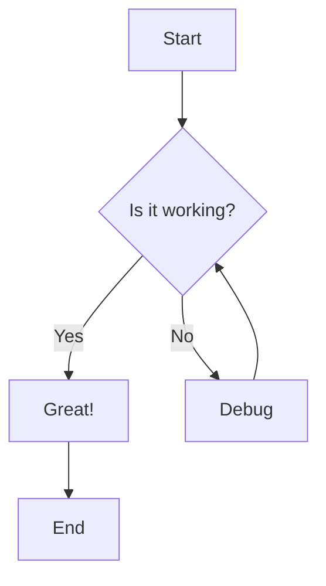

# Tiptap Markdown Editor Demo

Welcome to the **Tiptap Markdown Editor** - a WYSIWYG editor for VS Code!

## Features

### Text Formatting

You can use **bold**, *italic*, ~~strikethrough~~, and `inline code`.

### Lists

Unordered list:
- Item 1
- Item 2
  - Nested item 2.1
  - Nested item 2.2
- Item 3

Ordered list:
1. First item
2. Second item
3. Third item

### Task Lists

- [x] Completed task
- [ ] Incomplete task
- [ ] Another task

### Tables

| Feature | Status | Notes |
|---------|--------|-------|
| Basic editing | ✅ | Works great |
| Syntax highlighting | ✅ | Using Shiki |
| Math rendering | ✅ | Using KaTeX |
| Mermaid diagrams | ✅ | Interactive |

### Code Blocks

```javascript
function hello() {
  console.log("Hello from Tiptap!");
  return true;
}
```

```python
def greet(name):
    print(f"Hello, {name}!")
    return True
```

### Blockquotes

> This is a blockquote.
> It can span multiple lines.

### Links

Check out [Tiptap](https://tiptap.dev) and [VS Code](https://code.visualstudio.com).

### Horizontal Rule

---

## Math Support

Inline math: $E = mc^2$

Block math:

$$
\int_{-\infty}^{\infty} e^{-x^2} dx = \sqrt{\pi}
$$

## Mermaid Diagrams



## Try It Out!

Start editing this file and watch the live preview update!

